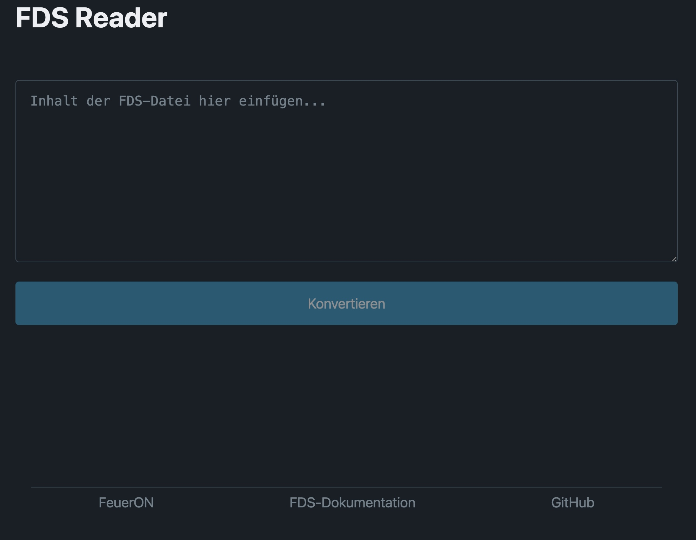

# fdsreader
Ein Browserbasiertes Lesewerkzeug für Drägerware/FeuerON FDS-Dateien.

## Installation
```shell
# nodejs/npm required
npm install
npm start
```

## Kompatibilität

Getestet mit FDS-Dateien folgender Leitstellensoftware:

- ISE Cobra

## Screenshot
